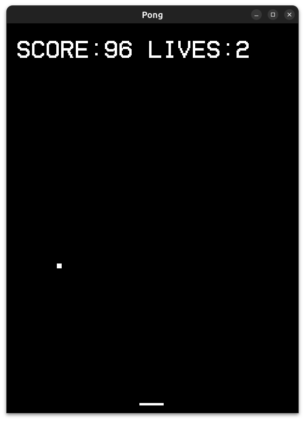

# Pong Game

A simple Pong game implemented using SFML in C++. This project includes basic gameplay mechanics with a bat and ball, and keeps track of scores and lives.

## Features

- Fullscreen window mode
- Player-controlled bat
- Ball rebounds off walls, bat, and resets when it hits the bottom
- Score and lives display

## Screenshots



## Installation

1. **Clone the repository**:

   ```bash
   git clone https://github.com/yourusername/your-repository-name.git
   ```

2. **Navigate to the project directory**:

   ```bash
   cd your-repository-name
   ```

3. **Install SFML**:
   Follow the instructions on the [SFML website](https://www.sfml-dev.org/download.php) to install SFML for your development environment.

4. **Compile the project**:
   Use a C++ compiler with SFML support to compile the project. For example, with `g++`:

   ```bash
   g++ -o pong main.cpp -lsfml-graphics -lsfml-window -lsfml-system
   ```

5. **Run the game**:
   ```bash
   ./pong
   ```

Or simply use `./run.sh`

## Usage

- **Arrow keys**: Move the bat left and right.
- **Escape**: Close the game window.

## Contributing

Feel free to open issues or submit pull requests if you have improvements or bug fixes!

## License

This project is licensed under the MIT License - see the [LICENSE](LICENSE) file for details.

## Acknowledgements

- SFML (Simple and Fast Multimedia Library) for the graphics and window handling.

### Instructions for the Screenshot Placeholder

1. **Take a Screenshot**: Run your game, take a screenshot, and save it to your project directory.

2. **Add the Screenshot**: Place your screenshot image in your project directory, ideally in a folder like `docs` or `assets`.

3. **Update the Placeholder**: Replace `path/to/your/screenshot.png` in the `README.md` with the actual path to your screenshot.

Feel free to adjust the installation, usage, and other sections according to the specifics of your project.
